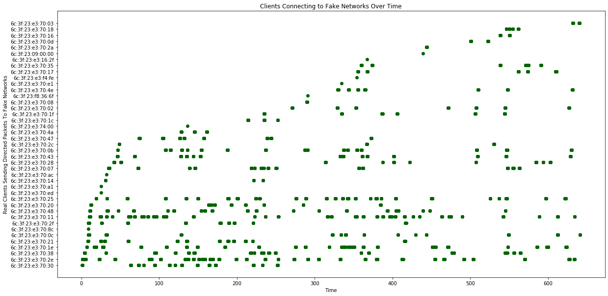
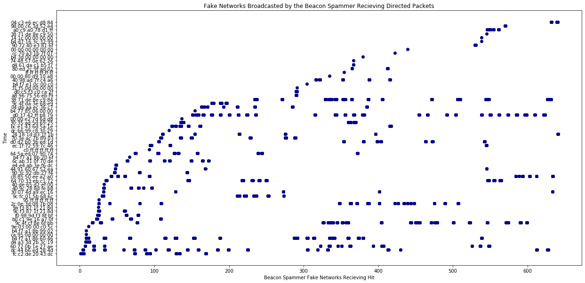
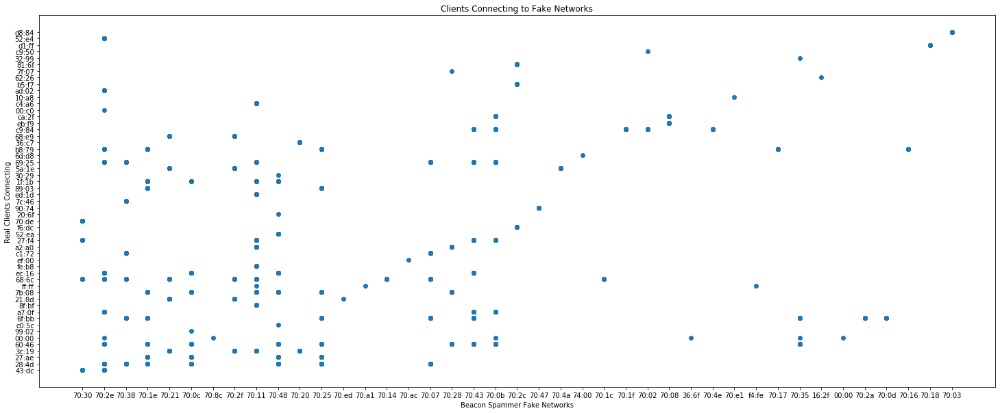

```python
## Here, we study a packet capture in which client Wi-Fi devices have their real MAC unmasked by fake networks.
## Nearly all devices randomize MAC addresses in public, but reveal their true MAC if they detect a trusted network.
## We will use many fake network to fingerprint client devices by which Wi-Fi networks they have connected to before.
## You can also see this as brute-forcing the "Preferred network list" stored inside each client device.
##
## This dataset was taken on a Red Line Metro train riding from Wilshire & Vermont to Hollywood & Highland during
## rush hour. 
##
## Tools used: ESP8266 with the "Beacon Spammer" Arduino sketch and a list of common Wi-Fi network names, Wireshark.
##
## CSV data is recorded from Wireshark capturing on the same channel as the ESP8266 is broadcasting on.
## Only directed packets (probes, authentication, association) from clients to fake networks have been exported.
##
## 
## Let's examine some data from the import, starting with a sample of 5 entries.


## We import a Wireshark export of devices responding to fake networks from the ESP8266 with authentication frames

import pandas as pd
from matplotlib import pyplot as plt
wd = pd.read_csv('/Users/skickar/MetroWilshireVermonttoHollywoodHighland.csv', delimiter = ',', encoding='latin-1', header=0) 
wd.tail()

```


<div>
<style scoped>
    .dataframe tbody tr th:only-of-type {
        vertical-align: middle;
    }

    .dataframe tbody tr th {
        vertical-align: top;
    }

    .dataframe thead th {
        text-align: right;
    }
</style>
<table border="1" class="dataframe">
  <thead>
    <tr style="text-align: right;">
      <th></th>
      <th>No.</th>
      <th>Time</th>
      <th>Source</th>
      <th>Destination</th>
      <th>Protocol</th>
      <th>Length</th>
      <th>Channel frequency</th>
      <th>Data rate (Mb/s)</th>
      <th>Channel</th>
      <th>Channel.1</th>
      <th>Transmitter address</th>
      <th>Destination address</th>
      <th>Type/Subtype</th>
      <th>Info</th>
    </tr>
  </thead>
  <tbody>
    <tr>
      <th>12389</th>
      <td>562980</td>
      <td>640.910788</td>
      <td>SamsungE_d3:1f:1b</td>
      <td>6c:3f:23:e3:70:0c</td>
      <td>802.11</td>
      <td>70</td>
      <td>2412</td>
      <td>1</td>
      <td>1</td>
      <td>1</td>
      <td>24:18:1d:d3:1f:1b</td>
      <td>6c:3f:23:e3:70:0c</td>
      <td>Authentication</td>
      <td>Authentication, SN=2137, FN=0, Flags=....R...C</td>
    </tr>
    <tr>
      <th>12390</th>
      <td>563024</td>
      <td>640.955612</td>
      <td>SamsungE_d3:1f:1b</td>
      <td>6c:3f:23:e3:70:0c</td>
      <td>802.11</td>
      <td>70</td>
      <td>2412</td>
      <td>1</td>
      <td>1</td>
      <td>1</td>
      <td>24:18:1d:d3:1f:1b</td>
      <td>6c:3f:23:e3:70:0c</td>
      <td>Authentication</td>
      <td>Authentication, SN=2137, FN=0, Flags=....R...C</td>
    </tr>
    <tr>
      <th>12391</th>
      <td>563049</td>
      <td>640.982755</td>
      <td>SamsungE_d3:1f:1b</td>
      <td>6c:3f:23:e3:70:0c</td>
      <td>802.11</td>
      <td>70</td>
      <td>2412</td>
      <td>1</td>
      <td>1</td>
      <td>1</td>
      <td>24:18:1d:d3:1f:1b</td>
      <td>6c:3f:23:e3:70:0c</td>
      <td>Authentication</td>
      <td>Authentication, SN=2137, FN=0, Flags=....R...C</td>
    </tr>
    <tr>
      <th>12392</th>
      <td>563062</td>
      <td>640.996201</td>
      <td>SamsungE_d3:1f:1b</td>
      <td>6c:3f:23:e3:70:0c</td>
      <td>802.11</td>
      <td>70</td>
      <td>2412</td>
      <td>1</td>
      <td>1</td>
      <td>1</td>
      <td>24:18:1d:d3:1f:1b</td>
      <td>6c:3f:23:e3:70:0c</td>
      <td>Authentication</td>
      <td>Authentication, SN=2138, FN=0, Flags=....R...C</td>
    </tr>
    <tr>
      <th>12393</th>
      <td>563067</td>
      <td>641.001216</td>
      <td>SamsungE_d3:1f:1b</td>
      <td>6c:3f:23:e3:70:0c</td>
      <td>802.11</td>
      <td>70</td>
      <td>2412</td>
      <td>1</td>
      <td>1</td>
      <td>1</td>
      <td>24:18:1d:d3:1f:1b</td>
      <td>6c:3f:23:e3:70:0c</td>
      <td>Authentication</td>
      <td>Authentication, SN=2138, FN=0, Flags=....R...C</td>
    </tr>
  </tbody>
</table>
</div>


```python
## Examining the contents of a directed probe request to a fake network from a client
wd.iloc[61]
```


    No.                                                                 2843
    Time                                                             3.83517
    Source                                                 SamsungE_ed:28:4d
    Destination                                            6c:3f:23:e3:70:38
    Protocol                                                          802.11
    Length                                                               109
    Channel frequency                                                   2412
    Data rate (Mb/s)                                                       1
    Channel                                                                1
    Channel.1                                                              1
    Transmitter address                                    dc:44:b6:ed:28:4d
    Destination address                                    6c:3f:23:e3:70:38
    Type/Subtype                                               Probe Request
    Info                   Probe Request, SN=1389, FN=0, Flags=....R...C,...
    Name: 61, dtype: object


```python
## Plotting directed packets (unmasked clients) connecting to fake networks over time
# Here, we analyze when a clients is connecting to a fake network over time in the first figure.
# In the second, we analyze which fake networks are recieving directed packets from unmasked clients over time.
plt.rcParams["figure.figsize"] = (20,10)
plt.plot(wd['Time'], wd['Destination address'], 'o', color='DarkGreen')
plt.title('Clients Connecting to Fake Networks Over Time')
plt.xlabel('Time')
plt.ylabel('Real Clients Sending Directed Packets To Fake Networks')
plt.show()
plt.plot(wd['Time'], wd['Transmitter address'], 'o', color='DarkBlue')
plt.title('Fake Networks Broadcasted by the Beacon Spammer Recieving Directed Packets')
plt.xlabel('Beacon Spammer Fake Networks Recieving Hit')
plt.ylabel('Time')
plt.show()
```








```python
## Plotting which client MAC addresses responds to which fake network MAC addresses
## Here, we see a fingerprint for every client device on the left. 
## We can scan the row a device is in to determine which unique fake networks it will respond to.
## We can scan a column to find which fake networks cause the most client devices to respond. 
plt.rcParams["figure.figsize"] = (25,10)
plt.plot(wd['Destination address'].str[-5:], wd['Transmitter address'].str[-5:], 'o',)
plt.title('Clients Connecting to Fake Networks')
plt.xlabel('Beacon Spammer Fake Networks')
plt.ylabel('Real Clients Connecting')
plt.show()
```




