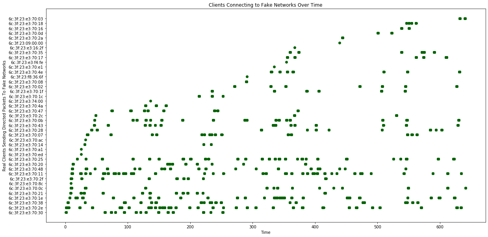
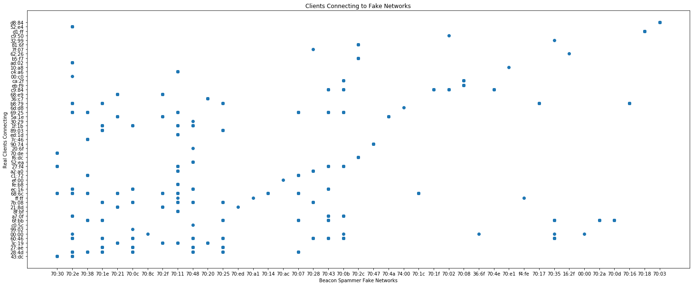

```python
## Here, we study a capture in which real clients have had their real MAC addresses unmasked by a fake network.
## When a Client responds to a fake network, this a "hit" occurs
## A "hit" means we've matched a network stored on the Preferred Network List of the targeted Client device.


## We import a Wireshark export of devices responding to fake networks from the ESP8266 with authentication frames

import pandas as pd
from matplotlib import pyplot as plt
wd = pd.read_csv('/Users/skickar/MetroWilshireVermonttoHollywoodHighland.csv', delimiter = ',', encoding='latin-1', header=0) 


## Here we have an example of a frame of data from row 59
wd.iloc[59]

```


    No.                                                                 2841
    Time                                                             3.83325
    Source                                                 SamsungE_ed:28:4d
    Destination                                            6c:3f:23:e3:70:38
    Protocol                                                          802.11
    Length                                                               109
    Channel frequency                                                   2412
    Data rate (Mb/s)                                                       1
    Channel                                                                1
    Channel.1                                                              1
    Transmitter address                                    dc:44:b6:ed:28:4d
    Destination address                                    6c:3f:23:e3:70:38
    Type/Subtype                                               Probe Request
    Info                   Probe Request, SN=1389, FN=0, Flags=....R...C,...
    Name: 59, dtype: object


```python
## Plotting devices broadcasting real MAC Address in response to fake network from the Beacon Spammer
plt.rcParams["figure.figsize"] = (20,10)
plt.plot(wd['Time'], wd['Transmitter address'], 'o' )
plt.show()
```


```python
## Plotting MAC Address randomization of the Beacon Spammer under devices responding (Beacon below, clients above)
plt.rcParams["figure.figsize"] = (20,10)
plt.plot(wd['Time'], wd['Destination address'], 'o')
plt.plot(wd['Time'], wd['Transmitter address'], 'o')
plt.show()
```





```python
## Plotting which client MAC addresses respond to which fake network MAC addresses
plt.rcParams["figure.figsize"] = (20,10)
plt.plot(wd['Destination address'].str[-2:], wd['Transmitter address'].str[-5:], 'o',)
plt.title('Clients Connecting to Fake Networks')
plt.xlabel('Beacon Spammer Fake Networks')
plt.ylabel('Real Clients Connecting')
plt.show()
```





```python

```


```python

```
